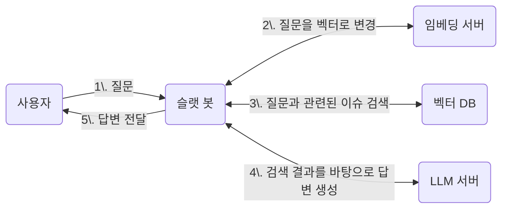

# 프로젝트 루모스

## 서비스 구성도 초안



## Qdrant

**벡터 DB 실행**

```shell
docker pull qdrant/qdrant
docker run -p 6334:6334 qdrant/qdrant
```

## [llama.cpp](https://github.com/ggml-org/llama.cpp)

### Models

Embedding models
* [Qwen3-Embedding-0.6B](https://huggingface.co/Qwen/Qwen3-Embedding-0.6B-GGUF)
* [Qwen3-Embedding-4B](https://huggingface.co/Qwen/Qwen3-Embedding-4B-GGUF)
* [Qwen3-Embedding-8B](https://huggingface.co/Qwen/Qwen3-Embedding-8B-GGUF)

LLM models
* [Qwen3-8B](https://huggingface.co/Qwen/Qwen3-8B-GGUF)

### Local Server 구성

**서버 빌드**

```shell
# 자세한 빌드 가이드는 아래 링크에서 확인
# https://github.com/ggml-org/llama.cpp/blob/master/docs/build.md

git clone https://github.com/ggml-org/llama.cpp --depth=1
cd llama.cpp

# cmake 설치 필요
cmake -B build
cmake --build build --config Release
```

**서버 실행**

```shell
# 자세한 서버 구성 가이드는 아래 링크에서 확인
# https://github.com/ggml-org/llama.cpp/blob/master/tools/server/README.md

# 임베딩 서버 실행
./build/bin/llama-server \
    --model qwen3-embedding-0.6B.gguf --embeddings \
    --pooling last \
    --ubatch-size 8192 \
    --ctx-size 0

# LLM 서버 실행
./build/bin/llama-server \
    --model qwen3-8B.gguf \
    --ctx-size 0
```

**서버 동작 확인**

```shell
curl http://localhost:8080/v1/embeddings \
    -d '
    {
        "input": "The sky is blue because of Rayleigh scatteringa",
        "encoding_format": "float"
    }'

curl http://localhost:8080/v1/chat/completions \
    -H "Content-Type: application/json" \
    -H "Authorization: Bearer no-key" \
    -d '
    {
        "messages": [
            {"role": "system", "content": "/no_think"},
            {"role": "user", "content": "Hello?"}
        ]
    }'
```

## 프로토타입 테스트

```shell
# 프로토타입 바이너리 생성
make prototype

# 임베딩 모델을 사용해 Jira 이슈 정보를 벡터로 변환.
./bin/prototype embedding \
    --input "jira-issue-list.json" \
    --output "embedding.json"

# 변환된 벡터 데이터를 Qdrant에 저장.
./bin/prototype insert \
    --file "embedding.json"

# BM42 인덱싱 (Qdrant에 sparse vector로 저장)
# 먼저 Python 의존성 설치
pip install -r scripts/requirements.txt

# BM42 인덱싱 실행
./bin/prototype bm42-index \
    --input "json/gs_issues.json" \
    --collection "jira_bm42"

# Qdrant 유사도 검색 결과 출력.
./bin/prototype search \
    --query "질문" \
    --output "context.json"

# 하이브리드 검색 (BM42 + 임베딩)
./bin/prototype hybrid-search \
    --query "보안 점검" \
    --output "context.json"

# 참고자료와 함께 AI에게 질문.
./bin/prototype chat \
    --context "context.json" \
    --query "질문"
```

### 검색 방식

| 검색 방식 | 설명 | 특징 |
|---------|------|------|
| BM42 검색 | Qdrant DB의 sparse vector + fastembed | 어텐션 기반, 의미적 텍스트 매칭 |
| 임베딩 검색 | Qdrant DB의 dense vector 사용 | 의미 기반, 유사도 검색 |
| 하이브리드 | BM42 + 임베딩 결합 | 가중치 기반 통합 검색 |
